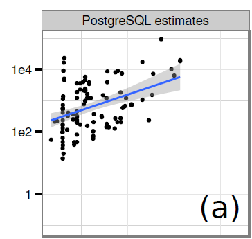
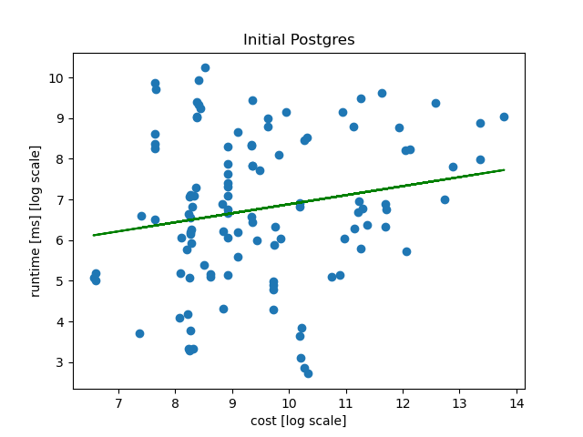
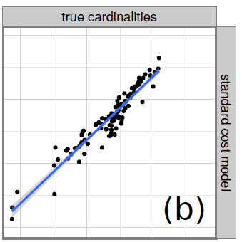
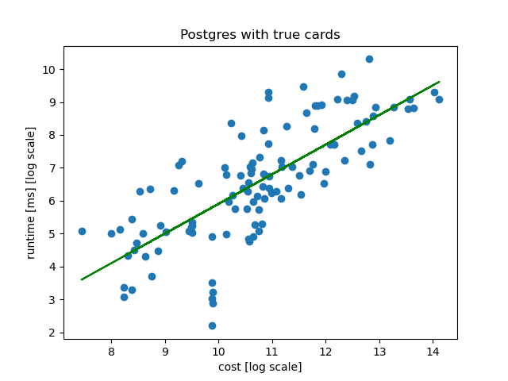
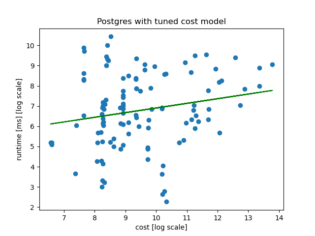
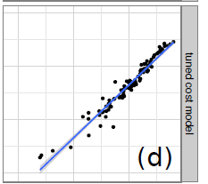
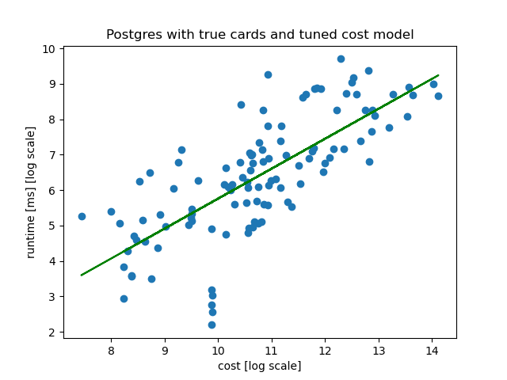

# Paper: How Good Are Query Optimizer, Really?

I reimplemented the first 4 experiments in the part of **Cost Model**.

## I. Experiment Setup

All performance experiments were performed on a virtual machine with 1 intel i7-8700 CPU (3.2g=GHz), a total of 6 cores and 6GB RAM running PostgreSQL 15 on Ubuntu 22.04. Postgres **did not parallelize queries** (via setting max_parallel_workers_per_gather as 0) like the paper so that only a single core was running during query processing. I **did not cache the IMDB dataset into the RAM** before query processing (which is different from the paper). I ran all queries 3 times and take the mean as the real runtime.

## II. Experiment Result

We define the absolute percentage error of a cost model for a Query Q as 
$$
\epsilon(Q)=\frac{|T_{real}(Q)-T_{pred}{Q}|}{T_{pred}(Q)}
$$

### Experiment 1 

Run JOB in **unmodified PG** and catch the cost and runtime.

The following figure just plot the cost and runtime.

Then take the log of cost and runtime, plot them and compare with the result in the paper. 

The error of our result is 1.115.

    

### Experiment 2

Run JOB in **PG with true card** and catch the cost and runtime. 

The following figure just plot the cost and runtime.

Then take the log of cost and runtime, plot them and compare with the result in the paper. 

The error of paper's result is 0.38, the error of our result is 0.901.

    

### Experiment 3 

Run JOB in **PG with tuned cost model (enlarge cpu cost 50 times)** and catch the cost and runtime.

The following figure just plot the cost and runtime.

Then take the log of cost and runtime, plot them and compare with the result in the paper. 

The error of our result is 1.114.

    

### Experiment 4

Run JOB in **PG with true card tuned cost model (enlarge cpu cost 50 times)** and catch the cost and runtime. 

The following figure just plot the cost and runtime.

Then take the log of cost and runtime, plot them and compare with the result in the paper. 

The error of paper's result is 0.30 (0.38 in Experiment 2), the error of our result is 0.878 (0.901 in Experiment 2).

    

## III. Thoughts

1. 输入准确基数后得到的cost和runtime的线性关系仍然很差，虽然对于cost和runtime进行log处理之后的线性关系好了一些，但由于cost model直接比较cost选择执行计划，这样log处理之后的线性关系并不能说明问题。

   Assume cost as c and runtime as t. If log(t) = a*log(c) + b, then t = 10^b * c^a.

2. 我们的实验结果有论文中的结果有着比较大的差别，其中的具体原因还需要进一步确认。

