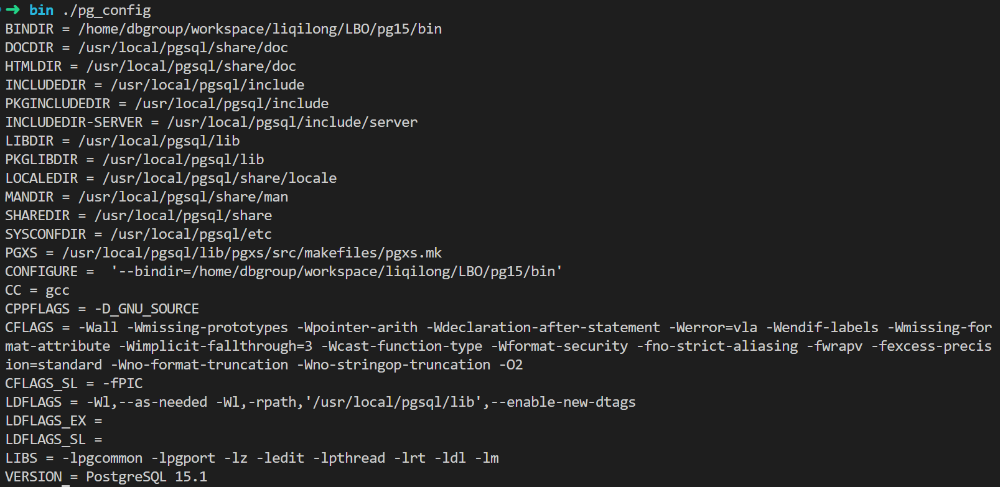

# Install Postgres pg_hint_plan extension

**official website: https://github.com/ossc-db/pg_hint_plan**

The official website has introduced the simplest installation procedures. If you install PostgreSQL via ubuntu package with method like ```apt install postgres```, you may easily install ```pg_hint_plan``` with the commands in the official doc.  However, if you install ```pg_hint_plan``` for PostgreSQL built from source code and you change the position of bin/ or lib/ director, you will need to modify the Makefile and specification files.

## 1. pg_config

``pg_config`` is a postgres command and you could get the corresponding postgres' configurations via this command. The following the output of command ```pg_config```, you could get the location of bin/, include/ and lib/ of Postgres. You could check whether you use the right ```pg_config``` via version and location of postgres.



## 2. Modify Makefile

change the location of ``PG_CONFIG`` to the corresponding location of postgres in line 37.

## 3. Modify SPECS/pg_hint_plan<pg_version>.spec

Modify ```_pgdir```, ```_bindir```, ```_libdir```, ```_datadir```. You could obtain the location info via command ```pg_config```.


