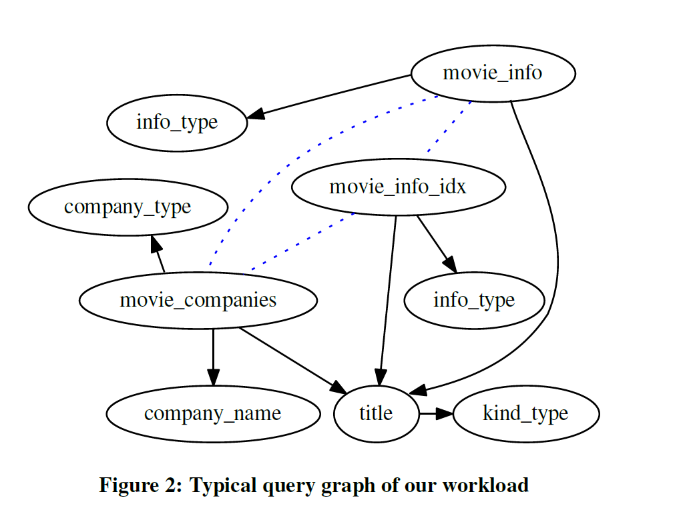

# JOB Benchmark Analysis

## 1. IMDB dataset statistic

### (1) Table list

|      Table      | Row Number |                 Indexed Columns                  | Unindexed Column |
| :-------------: | :--------: | :----------------------------------------------: | :--------------: |
|    cast_info    |  36231584  | id, movie_id, person_id, person_role_id, role_id |     nr_order     |
|   movie_info    |  14803594  |            id, movie_id, info_type_id            |       info       |
|  movie_keyword  |  4523930   |             id, movie_id, keyword_id             |                  |
|      name       |  4167151   |                        id                        |       name       |
|    char_name    |  3140292   |                        id                        |       name       |
|   person_info   |  2966063   |           id, person_id, info_type_id            |       info       |
| movie_companies |  2609129   |    id, company_id, movie_id, company_type_id     |       note       |
|      title      |  2528527   |              id, kind_id, movie_id               |      title       |
| movie_info_idx  |  1380035   |            id, movie_id, info_type_id            |       info       |
|    aka_name     |   901343   |                  id, person_id                   |       name       |
|    aka_title    |   361472   |                   id, kind_id                    |     movie_id     |
|  company_name   |   234997   |                        id                        |       name       |
|  complete_cast  |   135086   |                   id, movie_id                   |    subject_id    |
|     keyword     |   134170   |                        id                        |     keyword      |
|   movie_link    |   29997    |   id, movie_id, linked_movie_id, link_type_id    |                  |
|    info_type    |    113     |                        id                        |       info       |
|    link_type    |     18     |                        id                        |       link       |
|    role_type    |     12     |                        id                        |       role       |
|    kind_type    |     7      |                        id                        |       kind       |
| comp_cast_type  |     4      |                        id                        |       kind       |
|  company_type   |     4      |                        id                        |       kind       |

#### (2) Join Relations

This figure is from paper **How Good Are Query Optimizer, Really?**

